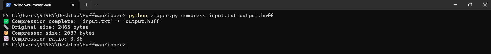

# Huffman File Zipper 🔐📦

A fast and efficient file compression tool built using **Huffman Coding**, a Data Structures and Algorithms (DSA) concept. Ideal for educational use or lightweight file archiving via the command line interface (CLI).

## 🚀 Features

- 📂 Compress and decompress any file type
- ⚙️ Uses Huffman Coding for lossless compression
- 📊 Displays original size, compressed size, and compression ratio
- 🧠 Efficient memory usage with streaming support (WIP)
- 🖥️ Command-line interface for ease of use

## 🧪 Usage

### 📥 Compress a File

How to run the code : 
in bash
python zipper.py compress input.txt output.huff

